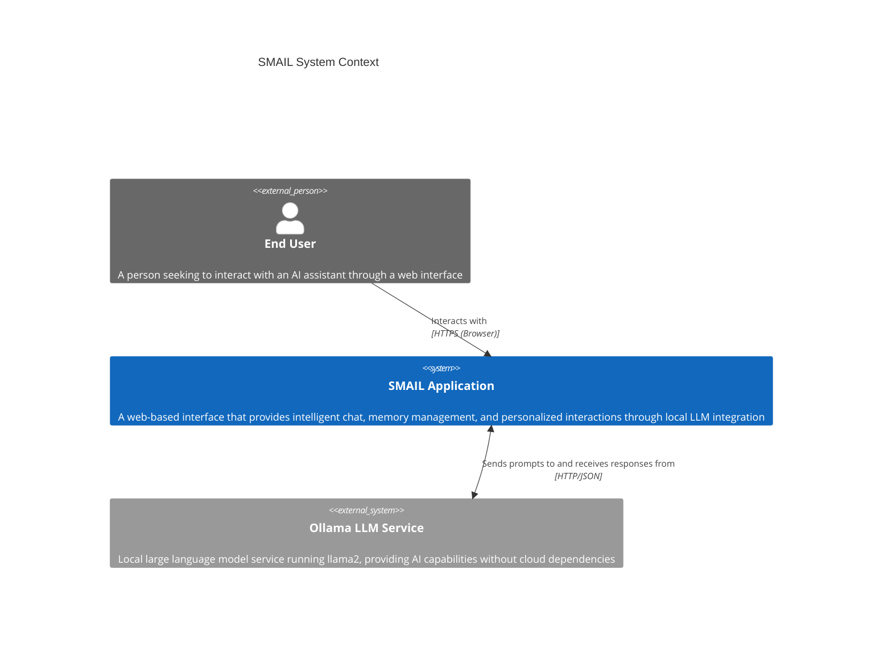
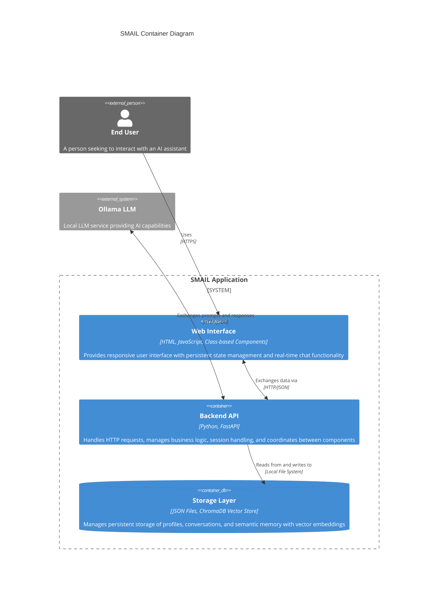

# SMAIL - Simple Machine Learning Interface

A simple web interface for interacting with a local LLM using Ollama.

## Prerequisites

- Python 3.8 or higher (required for both installation and runtime)
- Ollama installed and running locally
- A compatible LLM model (default: llama2)

## Setup

1. Install Ollama following instructions at [Ollama's website](https://ollama.ai/)

2. Pull the llama2 model:
```bash
ollama pull llama2
```

3. Install Python dependencies:
```bash
pip install -r requirements.txt
```

4. Run the application:
```bash
uvicorn app:app --reload
```

5. Open your browser and navigate to `http://localhost:8000`

## Usage

- Type your message in the input field and press Enter or click Send
- The LLM will process your message and respond
- Chat history persists between page navigations and browser sessions
- Use the Profile page to customize your experience
- Visit the Memories page to view conversation history and extracted facts

## Architecture

### System Context (C4 Level 1)


### Container Diagram (C4 Level 2)


### Components
- Frontend: HTML/JavaScript with class-based state management
- Backend: FastAPI (Python) with persistent storage
- LLM: Ollama (local) with llama2 model
- Storage: JSON-based persistence for conversations and profiles
- Memory: ChromaDB for vector storage and fact extraction
